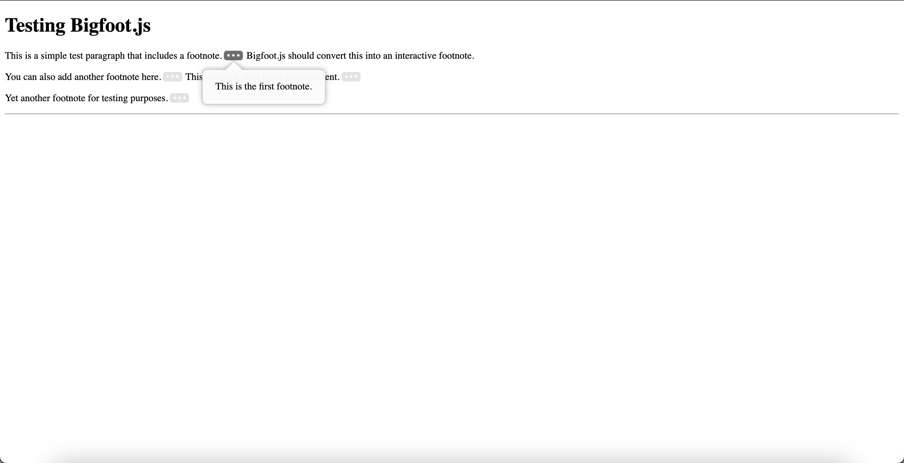
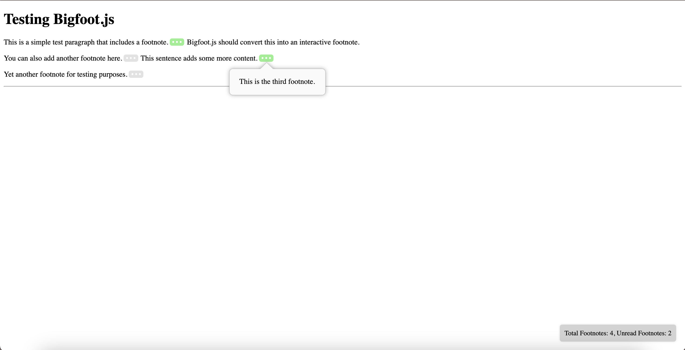

# Bigfoot.js Review

## Overview
Bigfoot.js is a lightweight library designed for managing footnotes in web content. It enhances footnote interaction by adding tooltip-like footnote displays.

## Architecture
- **Design Decisions**: The package is focused on simplicity and enhanced user experience for footnotes. Its primary feature is footnote management through tooltips.
- **Code Organization**: The source code is structured using SCSS for styling and CoffeeScript for logic. These older technologies could pose maintainability challenges due to their decreasing usage and support.
- **Quality**: 
  - **Patterns**: The code follows basic modular JavaScript patterns, though it is hampered by reliance on jQuery (version < 3.0), which can lead to security and compatibility issues.
  - **Language**: CoffeeScript, while offering conciseness, is now less favored in modern development, creating potential learning curve and support issues.
- **Repository Organization**: The repo is relatively clean but lacks comprehensive documentation. There are minimal comments within the code, making it harder to understand for new developers.

## Tooling Challenges
- **Older jQuery version**: This poses potential compatibility issues with modern libraries and frameworks.
- **SCSS and CoffeeScript**: These technologies are outdated and could introduce additional overhead in terms of tooling and onboarding developers.
- **Lack of proper documentation**: The absence of detailed usage and configuration documentation can slow down development.

## Feature Implementation: Tracking Footnotes
As part of the task, we successfully got the code running and added a new feature to track the total number of footnotes and unread footnotes. Additionally, we implemented a feature where the footnote button changes its color to green once it is read. 

Before Adding Additional Features:

After Adding Additional Features:

The key aspects of this feature:
- **Default Behavior**: The default state of the footnote button is set to "unread" (tracked as `true`).
- **Unread Footnote Count**: The number of unread footnotes is dynamically updated as users interact with the footnotes.
- **Button Color Change**: Upon reading a footnote, the button changes to green, providing visual feedback to users.
  
### Images of the Feature:
(Insert images here)

## Decision
We would **not use Bigfoot.js** in larger projects due to:
- **Compatibility Issues**: The reliance on older versions of jQuery and CoffeeScript can cause conflicts with newer tech stacks.
- **Lack of Documentation**: This increases the time to implement and troubleshoot the library.
  
## Recommendations
- **Mitigation**: Migrating to modern JavaScript (ES6+), using a CSS-in-JS solution, and removing jQuery dependency would be necessary. This effort would likely take several weeks, depending on the project scope and team size.
